# Markdown

## Markdown


- Lenguaje de marcado (etiquetas).
- Describes con etiquetas dentro del documento la manera como se debe ver el documento.
- Texto plano.
- Creado para ser fácil de escribir y leer.

## Historia 

John Gruber (con ayuda from Aaron Swartz) se cansó de escribir emails en html. En 2004 creó un script* `Markdown.pl` (Perl) que convertía Markdown a HTML.

`md -> Markdown.pl -> HTML`

<div class="notes">
<b>Script</b>: un archivo ejecutable con código que funciona por si solo.
</div>

## Beneficios

- Ligero.
- Formato Abierto.
- Reproducible.
- Ubicuo.
- Extensible.
- **Es texto plano!!!**

## Es texto {.smaller }

- Garantía de tener siempre acceso a tus documentos, en 30 años no podras acceder a tu documento en Word o PowerPoint.
- Puedes manejar los cambios con git.
- Puedes ver con cambios que tuvo en el tiempo o la diferencia entre entre dos documentos.
- Puedes usar un editor de texto para hacer regex.
- Puedes usar scripts para manipular su contenido.
- Puedes encontrar el archivo por su contenido.
- Ocupa minimo espacio.
- Es más fácil de comprartir (pastebin, gist, github)
- Se puede editar independiente del software instalado (incluso desde un teléfono móvil.)


# Linea de Comandos

## IDE

[CS50 Sandbox](https://sandbox.cs50.io/)

##  Pandoc

Conviertidor de lenguajes de marcado. Librería* de Haskell.
<div class="notes">
<b>Librería:</b> conjunto de scripts, funciones pre-escritas.
</div>

`md -> pandoc -> HTML`

`md -> pandoc -> Latex -> pdf`

```{sh, eval=FALSE}
apt install texlive-latex-base
apt install texlive-fonts-recommended
apt install pandoc
```
```{sh, eval=FALSE}
pandoc file.md -o file.html
pandoc file.md -o file.pdf

```

# Sintaxis Markdown

## Secciones {.smaller }

```{markdown}
# Introducción
este el el primer parragrafo de la introduccion

# Resumen
una introducccion a Rmarkdown

# Marco conceptual
Mas texto

## rapidez
 un monton de texto random

## sencillez
mas texto para rellenar


# conclusión
Rmarkdown es facil de usar

```

<div class="notes">
Puedes usar Latex! <br><b>\\tableofcontents</b>
</div>

## Texto

Markdown      | resultado
-             | -
`*Cursiva*`   | *Cursiva*
`_Cursiva_`    | _Cursiva_
`**Negrita**` | **Negrita**
`__Negrita__`  | __Negrita__
`~~Tachado~~` | ~~Tachado~~

## Links

```{md}
[Evidencia](https://evidencia-pe.com/)
```

[Evidencia](https://evidencia-pe.com/)

## Imágenes

```{md}


```


* * *

```{md}

```


## Listas 

```{markdown}
- Primero
- Segundo
	- Tercero
```

- Primero
- Segundo
	- Tercero

* * *

```{markdown}
1. Primero
1. Segundo
 - Tercero
 - Cuarto
1. Último
```

1. Primero
1. Segundo
	- Tercero
	- Cuarto
1. Último

## Tablas

```{md}
primero | segundo
-       | -
tercero | cuarto

```

primero | segundo
-|-
tercero | cuarto

## Metadatos

```{YAML}
---
author: Andy
title: Rmarkdown
header-includes:
 - \usepackage[utf8]{inputenc}
 - \usepackage[spanish]{babel}
---
```

## Bloque de Código

````markdown
`r ''````{c}
#include <stdio.h>

int main(void)
{
  print("hello, world\n");
}
```
````

# A practicar

## Clonar un repositorio de Github {.smaller }

`git clone https://github.com/Evidencia-pe/demo-markdown`

# Rmarkdown

## Que es Rmarkdown?


- Una dialecto de Markdown.
- Markdown establece la sintáxis (estructura, reglas) y semantica (significado).
- Rmarkdown es un superconjunto extricto de Markdown, las caracteristicas que existen en Rmarkdown que no hay en markdown se le conoce como extensiones.

## Que hace Knitr?


Es una librería de R que **Teje** un bloque de código y sus resultados en markdown utilizando pandoc.

`Rmd -> knitr | R -> md -> pandoc -> HTML | pdf`

```{R, eval=FALSE}
install.packages("rmarkdown")
install.packages("knitr")
```

## Ejecutando Rmarkdown
```{markdown}
---
author: Andy Rufasto
title: Test Rmarkdown
output: html_document
---
```

```{r, eval=FALSE}
library("rmarkdown")
library("knitr")
rmarkdown::render("file.Rmd")
```

* * *

En Rstudio:
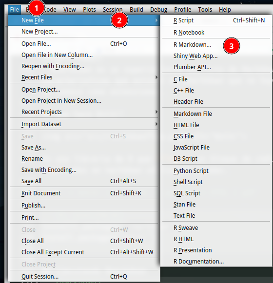

***
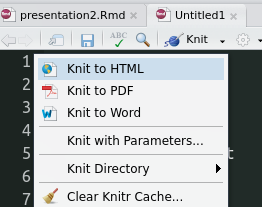

## Formatos: Documentos

**html_notebook :** Interactive R Notebooks

**html_document: ** HTML document w/ Bootstrap CSS

**pdf_document: ** PDF document (via LaTeX template)

**word_document: ** Microsoft Word document (docx)

**odt_document: ** OpenDocument Text document

## Formatos: Presentaciones (Slides)

**ioslides_presentation** - HTML presentation with ioslides

**revealjs::revealjs_presentation** - HTML presentation with reveal.js

**slidy_presentation:** - HTML presentation with W3C Slidy

**beamer_presentation:** PDF presentation with LaTeX Beamer

**powerpoint_presentation:** PowerPoint presentation

## Bibliografía

```{}
---
...
bibliography: src/econ.bib
---

```
```{md}
según [@myrdal30]
```


**Referencias**

Myrdal, Gunnar. 1930. _The Political Element in the Development of Economic Theory_.


## CSS personalizado

```{YAML}
---
output:
 html_document:
  css: style.css
---
```

```{CSS Custom css}

h2 {
	color: #B53838;
}

```

## Bloques de código {.smaller }

### Mostrar y ejecutar código

````markdown
`r ''````{r}
c <- c(3,5,8,3,9)
plot(c)
```
````

### Ejecutar sin mostrar el código

````markdown
`r ''````{r, include=FALSE}
c <- c(3,5,8,3,9)
plot(c)
```
````


### Mostar el código sin ejecutarlo

````markdown
`r ''````{r, eval=FALSE}
c <- c(3,5,8,3,9)
plot(c)
```
````

## Reticulate

Librería de R que permite ejecutar código de Python.

```{r, eval=FALSE}
install.packages("reticulate")
```

# Github

## Fork

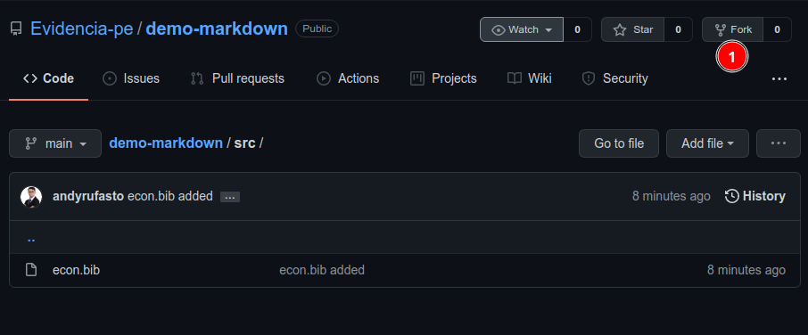

* * *

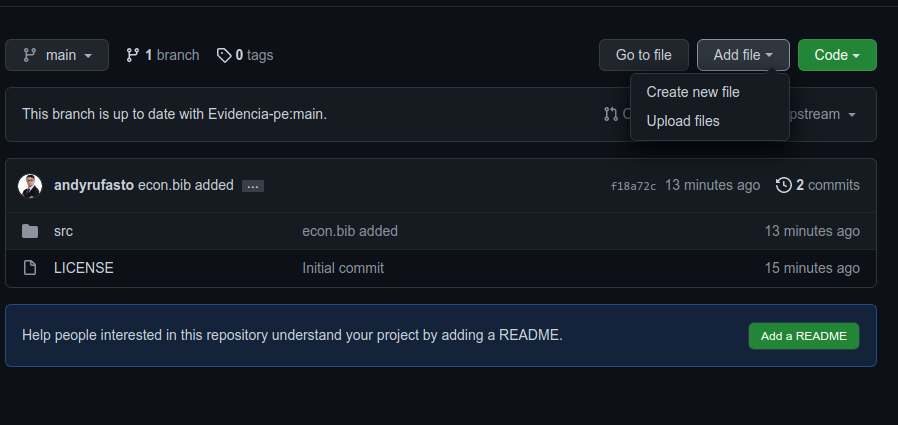

* * *
Github puede previsualizar Markdown

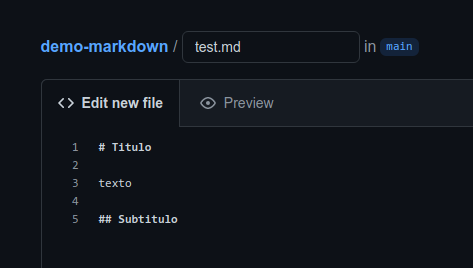

## Commit
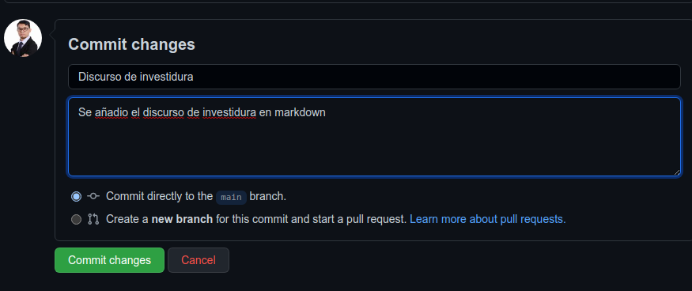

## Pull Request
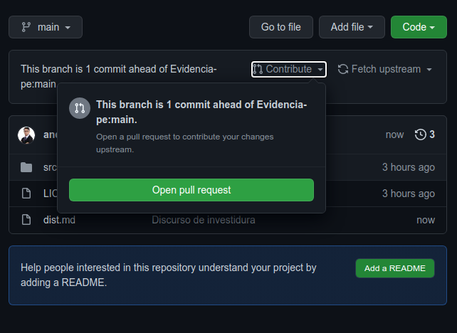

* * *

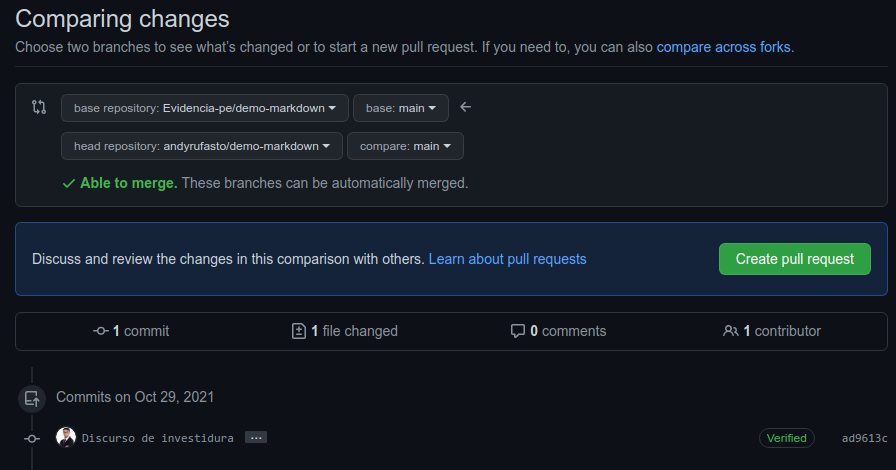

* * *

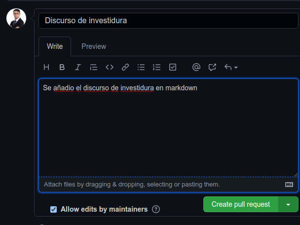

## Merge

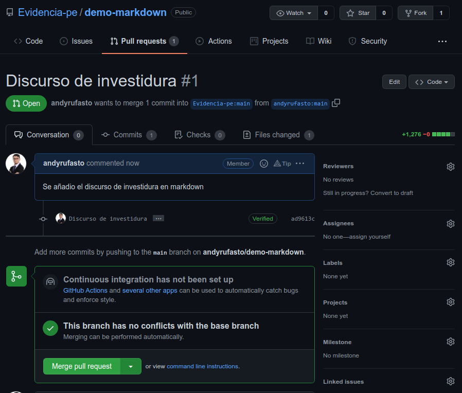

* * *

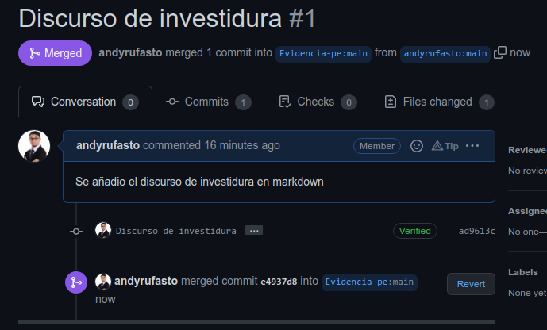

